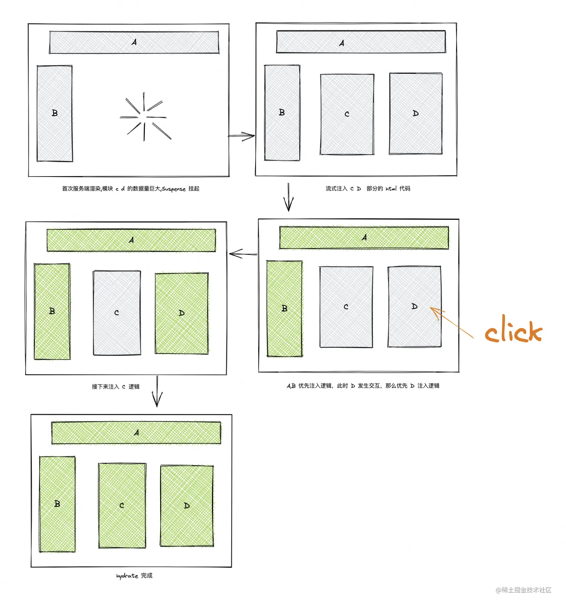

#### SuspenseList

Suspense 异步组件的原理本质上是让组件先挂起来显示 fallback 的内容，等到请求数据之后，再渲染已经注入数据的组件。但是如果存在多个 Suspense 异步组件，并且想要控制这些组件的展示顺序，就可以使用 SuspenseList

SuspenseList 有两个属性

- revealOrder：设置包裹的 Suspend 异步组件的显示顺序

  - forwards：从前向后
  - backwards：从后向前
  - together：所有的子组件都准备好了再显示

- tail：如何显示 SuspenseList 中未加载的组件

  - 默认情况下会显示列表中每个 Suspense 的 fallback
  - collapsed：仅显示 Suspense 列表中下一个 Suspense 的 fallback
  - hidden：未加载的组件不显示任何信息

```jsx
<SuspenseList revealOrder="forwards">
  <Suspense fallback={'加载中...'}>
    <CompA />
  </Suspense>
  <Suspense fallback={'加载中...'}>
    <CompB />
  </Suspense>
  <Suspense fallback={'加载中...'}>
    <CompC />
  </Suspense>
</SuspenseList>
```

#### Streaming SSR

在 React v18 中 对服务端渲染 SSR 增加了流式渲染（Streaming SSR）的特性，通过流式渲染可以实现以下两个功能

##### Streaming HTML

服务端可以分段传输 HTML 到浏览器，而不是像 React 18 以前一样，需要等待服务端渲染完成整个页面后才返回给浏览器，这样浏览器可以更快的启动 HTML 的渲染

例如对下面的组件作 SSR

```js
//文件1： Content.js
export default function Content() {
  return (
    <div> This is content </div>
  );
}

// 文件2：App.js
import { Suspense, lazy } from "react";
const Content = lazy(() => import("./Content"));
export default function App() {
  return (
    <html>
      <head></head>
      <body>
        <div>App shell</div>
        <Suspense>
          <Content />
        </Suspense>
      </body>
    </html>
  );
}
```

SSR 渲染的结果会分成 2 段传输

1. 先传输所有 Suspense 以上层级的可以同步渲染得到的 html 结构，并使用 template 标签为后续传输的 Suspense 的 children 渲染结果占位
2. 当 Suspense 内的组件渲染完成后，会把这部分组件对应的渲染结果，连同一个 JS 函数再传输到浏览器端，这个 JS 函数会更新 dom ，得到最终的完整 HTML 结构

```html
<!-- 第一段 -->
<!DOCTYPE html>
<html>
  <head></head>
  <body>
    <div>App shell</div>
    <!--$?-->
    <template id="B:0"></template>
    <!--/$-->
  </body>
</html>

<!-- 第二段 -->
<div hidden id="S:0">
  <div>This is content</div>
</div>
<script>
  function $RC(a, b) {
    a = document.getElementById(a);
    b = document.getElementById(b);
    b.parentNode.removeChild(b);
    if (a) {
      a = a.previousSibling;
      var f = a.parentNode,
        c = a.nextSibling,
        e = 0;
      do {
        if (c && 8 === c.nodeType) {
          var d = c.data;
          if ('/$' === d)
            if (0 === e) break;
            else e--;
          else ('$' !== d && '$?' !== d && '$!' !== d) || e++;
        }
        d = c.nextSibling;
        f.removeChild(c);
        c = d;
      } while (c);
      for (; b.firstChild; ) f.insertBefore(b.firstChild, c);
      a.data = '$';
      a._reactRetry && a._reactRetry();
    }
  }
  $RC('B:0', 'S:0');
</script>
```

##### Selective Hydration

视图注入 js 逻辑的过程叫做 hydration （注水）。在浏览器端 hydration 阶段，可以只对已经完成渲染的区域做 hydration，而不需要等待整个页面渲染完成、所有组件的 JS bundle 加载完成，才能开始 hydration。这样可以更早的对已经完成渲染的区域做事件绑定，从而让页面获得更好的可交互性

当渲染到 Suspense 组件时，会根据 Suspense 的 children 是否已经渲染完成，而选择是否继续向子组件执行 hydration。未渲染完成的组件待渲染完成后，会恢复执行 hydration

> Suspense 的 children 异步渲染的两种场景：children 组件做了 code splitting；children 组件中有异步操作

结合 Streaming HTML 和 Selective Hydration 的过程，服务端 SSR 流式渲染的过程如下

1. 初始化的渲染 A B 组件，C 和 D 通过 Suspense 的方式挂起
2. C 和 D 通过流式渲染的方式优先注入 html 片段，并优先注水 A B 的组件逻辑
3. 如果此时 D 发生交互，比如触发一次点击事件，那么 D 会优先注入逻辑
4. 最后 C 注入逻辑，整个页面 hydrate 完毕



参考

1. [v18 特性篇-Suspense](https://juejin.cn/book/6945998773818490884/section/7128573918901698599)
2. [React Streaming SSR 原理解析](https://mp.weixin.qq.com/s/w4FS5sBcHqRl-Saqi19Y6g)
