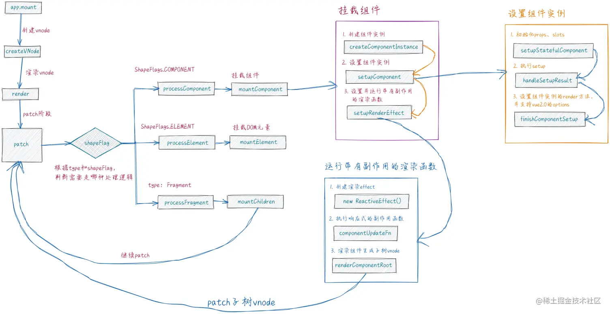
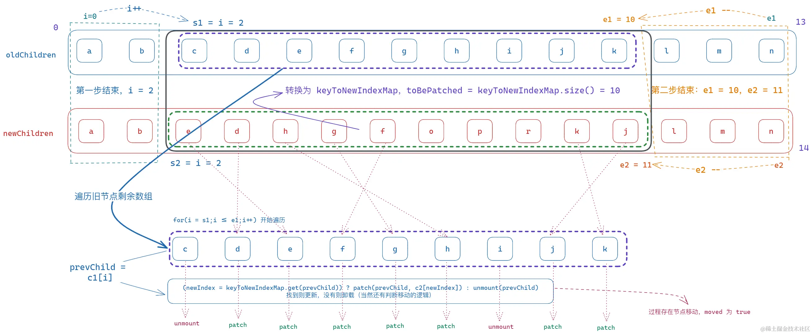

.vue文件是无法直接运行在浏览器中的，以webpack为例，会通过vue-loader将.vue文件编译为含有vue渲染函数的js代码。我们主要关注运行时vue做了什么事情

#### 挂载阶段

调用渲染函数返回虚拟DOM树。vue的运行时也是基于虚拟DOM的，虚拟DOM是保存在内存中的js对象，包含真实dom的信息并与之同步

挂载大致过程如下，核心方法是patch

- 如果是DOM元素直接挂载
- 如果是组件，则会创建组件实例、初始化相应的数据、触发生命周期等，运行对应的返回虚拟DOM树的渲染函数，并追踪所用到的响应式依赖。然后递归地执行patch，直到子节点都挂载完成

重点要看一下是如何追踪响应式依赖的，vue会在副作用函数如watch、computed、render等中进行依赖收集，借助Proxy将普通对象转换为响应式对象，拦截get、set、delete、属性查询等操作，然后建立一个副作用函数和响应式对象的Map

#### 更新阶段

当收集到的依赖发生变化时触发更新，创建一个更新后的虚拟DOM树，然后遍历新树并与旧树进行diff，最终将必要的更新应用到真实DOM上。vue diff算法会分别查找头部完全一致的内容和尾部完全一致的内容，将其排除后再比较剩余内容

> 对于没有添加key的元素，会删除旧节点和创建新节点的操作

假设现在有一组节点从a,b,c,d,e,f,g变化到从a,b,e,d,h,f,g，diff的过程如下，初始i=0，取旧节点最后一位索引e1=6，取新节点最后一位索引e2=6

1. 从头查找最长相同 key 节点：依次比较到第三个节点时跳出，此时i=2

2. 从尾部倒序查找最长相同 key 节点：依次比较到倒数第三个节点时跳出，此时e1=4，e2=4

3. 剩余节点对比

    1) 在新节点中循环i ~ e2之间的元素，构建成一个节点及其索引位置的Map
    2) 遍历旧节点对相同key值的节点进行复用和更新（patch），否则卸载（unmount）

    

    3) 如果该节点在旧节点中不存在会新建节点，否则移动节点。vue会构建一个新旧节点索引位置的Map，根据这个Map查找最长递增子串的元素下标，这样移动次数最少。该下标对应的新节点位置不变，其余节点进行移动

    

#### 带编译时信息的虚拟 DOM

虚拟DOM在React中是纯运行时的，更新时需要遍历整棵树，即使某些虚拟DOM子树并未发生改变但也需要重新创建，带来了不必要的内存损耗。Vue会在编译的时候会在代码中做一些标记，使得运行时尽可能走捷径

- 静态提升：对于没有绑定任何状态的元素，编译时会将这部分提升到渲染函数之外，更新时跳过差异化对比
- 更新类型标记：对于单个绑定状态的元素，编译时会标记该虚拟DOM所需的状态，更新时减少操作
- 树结构打平：编译运行时所需的虚拟DOM树时，跳过没有绑定任何状态的部分，并将绑定了状态的部分打平为一个数组

参考
1. [vue3 渲染图解](https://juejin.cn/post/7217693476494262329?searchId=202404121728584520F32FEA03D60A9525)
2. [官方文档](https://cn.vuejs.org/guide/extras/rendering-mechanism.html)
3. [diff算法](https://segmentfault.com/a/1190000043640781)